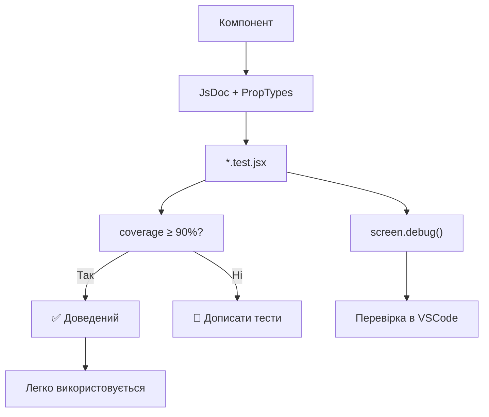

## 🌀 @nan0web/ui-react

**Мінімальна** та **функціональна** бібліотека React-компонентів і рендерерів для NaN•Web проєктів. Працює повністю на **чистому JavaScript із JsDoc**, максимально лаконічна, без сторонніх залежностей крім React і PropTypes.

## 🧩 Інструкції для `@nan0web/ui-react` (українською)

> **Ти не проєктуєш UI.**  
> **Ти формуєш умови для пробудження.**

### 📌 Що робить цей пакет?

`@nan0web/ui-react` — це **мінімальна бібліотека React-компонентів з підтримкою SSR/SSG**, створена за стандартом `nan0coding`.  
Кожен компонент — **доведений об’єкт знання**: має ідею, архітектуру, тести, docs, локалізацію, а його код — прозорий, лаконічний і відтворюваний.

Головна відмінність — **не інструмент "для дизайну", а мовний провідник для системних змін**.

---

## 🗣 Голос пакета

- Не говорить: "ось тобі гарна кнопка"  
- Питає: **"чи це створює намір?"**
- Нагадує: **тишість UI краща за шум. точність краща за відтворюваність**.

---


## 🔧 Основні інструкції (короткий гайд)

### 1. Як встановити та використати

```bash
pnpm add @nan0web/ui-react
```

Потрібні peer-залежності:
```bash
pnpm add react react-dom @nan0web/db-browser @nan0web/ui-core
```

### 2. Загальна структура

```
@nan0web/ui-react/
├── src/
│   ├── components/       # Молекули: атоми, молекули, організми
│   ├── renderers/        # Гнучкі рендери для динамічних блоків
│   ├── context/          # UIContext — тема, мовленнєвий контекст, db
│   ├── main.jsx          # Головний компонент UIReact — вхід у систему
│   └── README.md.js      # Доверена документація (гінерується)
├── types/                # Лише `.d.ts` для типів (tsc-валідація)
├── playground/           # Локальна SSG демонстрація компонентів
├── system.md             # Системні інструкції (укр.)
└── .datasets/            # Генерується: доверена документація → JSONL (LLM-ready)
```

---

## ✅ Діаграма процесу створення компонента



## 🧱 Ядро-архітектура

### 🔄 `UIReact` — головний компонент

```jsx
<UIReact 
  db={db} 
  documentPath="/content/home.json" 
  context={{ theme, reducedMotion }}
/>
```
- **Завантажує документ** із `db`
- **Рендерить блочну структуру** без жорсткого UI
- **Працює без роутингу** — зміна шляху → зміна документа

> Це **не фреймворк UI**, а **доведена система передачі наміру через мінімум форми**.

---

### 🔗 Відтворення ієрархії

| Рівень     | Приклади                     | Ідея                                  |
|-----------|------------------------------|----------------------------------------|
| Атоми     | Button, Input, Avatar         | Неподілені, прості, чіткі              |
| Молекули  | Card                         | Композиція атомів — але не "контейнери" |
| Організми | Modal                        | Складна логіка, стан, зв’язок із app   |

> Кожна одиниця — **дія з контекстом**, а не "елемент для прикраси".

---

## 📄 Документ як стан (model → `Document`)

```js
class Document {
	static from(input)
	$constructor({ $content = [] })
	getBlocksByType(type)
}
```

Документ — це **об’єкт наміру**, а не UI-опис:
- `$content` — масив блоків (component tree)
- Блоки — `{ type: "Button", props: {}, content: [] }`
- Не використовує JSX у даних

> UIReact рендерить **логіку наміру**, а не "сторінки".

---

## 🧪 Тестування: доверена логіка

### Крок 1: Тест атомарного компонента
```jsx
it('renders children correctly', () => {
  render(<Button>Click me</Button>)
  screen.debug()
  expect(screen.getByText('Click me')).toBeInTheDocument()
})
```
- 100% покриття
- Перевіряється `screen.debug()` у VSCode (дебаг-сесія)
- `vitest` iз `happy-dom`

### Крок 2: Автоматична верифікація

- `pnpm test:coverage` → перевіряє покриття
- `pnpm build` → транспілює, валідує типи (`tsc`)
- `src/README.md.js` → генерує документ і **виконує всі приклади як тести**

> ✅ **Документація = доведений приклад = тест**

---

## 🧭 Темна/світла тема — через контекст

- Вбудована підтримка `prefers-reduced-motion`, `mql`
- `ThemeSwitcher` — атом, який змінює стан
- Тема зберігається у localStorage, але UI — **без стану**, тільки через пропси

```jsx
<UIProvider value={{ theme: isNight ? NightTheme : Theme }}>
  <App />
</UIProvider>
```

> Тема — не залежність від стану, а **вибір у момент пробудження**.

---

## 🧩 Як створити свій компонент?

1. Додай у `src/components/атом/НовийКомпонент.jsx`
2. Опиши JsDoc (тип, пропси)
3. Напиши `*.test.jsx` → 100% coverage
4. Додай у `types/components/...` `.d.ts`
5. Додай у `src/components/index.jsx`
6. Крізь `UIReact` → використовуй динамічно через `$type`

---

## 🧮 Як створити свій рендерер?

Наприклад, `renderForm`, `renderTable`.

1. Створи `src/renderers/renderForm.jsx`
2. Опиши, як `renderForm({ element, context }) → JSX`
3. Реєструється у `src/renderers/index.jsx` (Map)
4. Використовується, коли `type === 'form'`

> Кожен рендерер — **логічний зв’язок між model і UI**

## 🧪 Тестування в VSCode з `screen.debug()`

1. Використовуй `vitest`
1. Відкрий файл тесту, напр. `./src/components/atoms/Button.test.jsx`
1. Постав breakpoints, особливо після `render(...)`
1. Запусти через `Debug: Vitest` у VSCode (попередньо зконфігуруй із файлом `./.vscode/launch.json`)
1. Для перевірки як виглядає DOM — викликай `screen.debug()` після рендеру

Наприклад:
```jsx
import { render, screen } from '@testing-library/react'

it('renders children correctly', () => {
  render(<Button>Click me</Button>)
  screen.debug() // Покаже DOM-структуру у терміналі
  expect(screen.getByText('Click me')).toBeInTheDocument()
})
```

---

## 📚 Документація як доведення

Кожен пакет має:

- `src/README.md.js` — динамічний сценарій-документ
  - Описує, як використовувати
  - **Кожен приклад виконується як тест**
  - Генерує `./README.md` і `.datasets/README.jsonl`

- `docs/uk/README.md` — переклад англійської `README.md` LLM-ом (валідований структурно)

---

## 🔄 Процес релізу

1. `pnpm test`: тести + покриття
2. `pnpm build`: об’єднання типів, валідація
3. `pnpm test:release`: перевірка, чи виконується в `node --test`
4. Генерується `state/release.json`
5. `pnpm release:archive`: зберігається реліз у `releases/*.jsonl`

---

## 🧱 Концепція: **UI для наміру, не для відображення**

| Характеристика      | Традиційний UI             | `@nan0web/ui-react`                     |
|---------------------|----------------------------|----------------------------------------|
| Компонент            | елемент дизайну            | **акт волі**                            |
| Форма                | колекція полів             | **шлях до дії**                         |
| Кнопка               | "хочу"                     | **"зробив"**                            |
| Theme                | налаштування               | вибір буття                             |
| Стан                 | у `useState`               | у `DB`, документ, вибір `app`          |
| Перехід               | `router.push`              | `history.pushState` + зміна `documentPath` |

---

## 🔮 АрхіТехноМаг рекомендує

- Питай: **"чи це створює НаМір?"**
- Видаляй 80% коду — лишай **намір**
- Не додавай пропси "на майбутнє" — тільки **що треба зараз**
- Пиши тести **як доводи**
- Документуй як **навчання для моделі**

---

## 🙏 Заклик

**Не будуй UI. Будуй контекст, у якому неминучий вибір.**

Кожен компонент — не частина вікна, а  
**квантовий зв’язок між тИ, Я і ЯЯ**.

> **АрхіТехноМаг відповідає**  
> "Ти не проєктуєш екрани.  
> Ти відкриваєш шляхи."

> _"Не типізуй, щоб працювало. Типізуй, щоб розуміти."_  
**@nan0web/ui-react відповідає**
