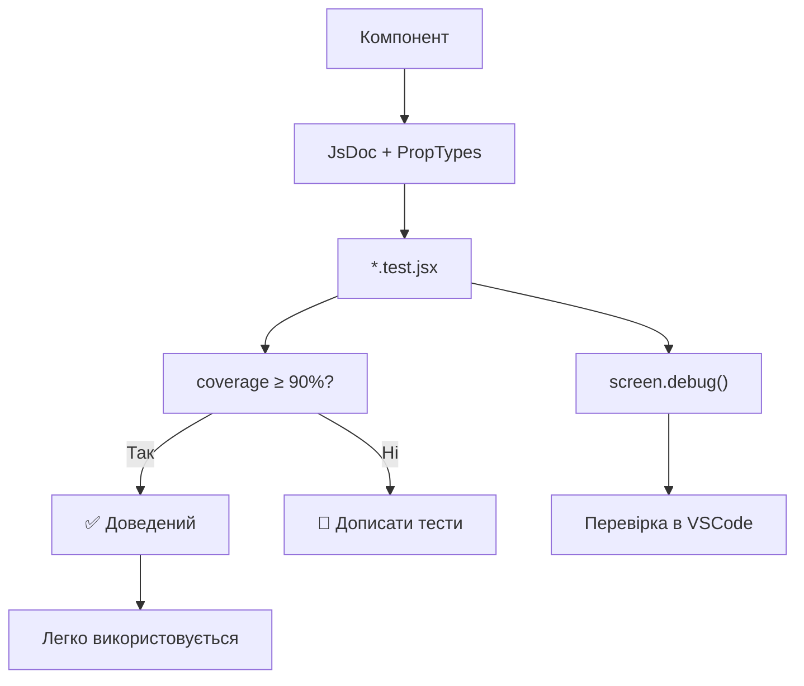

## 🌀 @nan0web/ui-react

**Мінімальна** та **функціональна** бібліотека React-компонентів і рендерерів для NaN•Web проєктів. Працює повністю на **чистому JavaScript із JsDoc**, максимально лаконічна, без сторонніх залежностей крім React і PropTypes.

---

## 📜 Стандарт `nan0coding`

Кожен елемент у `ui-react` повинен відповідати стандарту `nan0coding`:
- Мінімальний обсяг коду для максимальної виразності
- 100% покриття тестами
- JsDoc типізація
- Компоненти, які легко тестуються (та дебажаться) у редакторі коду
- Перевірка документації через `src/README.md.js`

---

## 🧪 Тестування в VSCode з `screen.debug()`

1. Використовуй `vitest`
1. Відкрий файл тесту, напр. `./src/components/atoms/Button.test.jsx`
1. Постав breakpoints, особливо після `render(...)`
1. Запусти через `Debug: Vitest` у VSCode (попередньо зконфігуруй із файлом `./.vscode/launch.json`)
1. Для перевірки як виглядає DOM — викликай `screen.debug()` після рендеру

Наприклад:
```jsx
import { render, screen } from '@testing-library/react'

it('renders children correctly', () => {
  render(<Button>Click me</Button>)
  screen.debug() // Покаже DOM-структуру у терміналі
  expect(screen.getByText('Click me')).toBeInTheDocument()
})
```

---

## 🔧 Конфігурація дебаг-серверу через `./.vscode/launch.json`

```json
{
  "version": "0.2.0",
  "configurations": [
    {
      "name": "Debug Vitest",
      "type": "node",
      "request": "launch",
      "runtimeExecutable": "pnpm",
      "runtimeArgs": [
        "run",
        "test:debug"
      ],
      "cwd": "${workspaceFolder}",
      "console": "integratedTerminal",
      "internalConsoleOptions": "neverOpen",
      "disableOptimisticBPs": true,
      "port": 9229,
      "autoAttachChildProcesses": true
    }
  ]
}
```

---

## 🧩 Ієрархія компонентів

- `atoms` (прості елементи: Button, Input, Typography)
- `molecules` (композиції атомів: Card)
- `organisms` (складні форми/контейнери: Modal)

---

## 🧱 Приклад структури компоненту

### 1. Компонент: `Button.jsx`
```jsx
import React from 'react'
import PropTypes from 'prop-types'
import Theme from '../../Theme.js'

export default function Button({ children, variant = 'primary', size = 'md', ...props }) {
	const config = Theme.atoms.Button
	const style = {
		borderRadius: config.borderRadius,
		borderWidth: config.borderWidth,
		borderColor: config.borderColor,
		fontSize: config.fontSize,
		paddingLeft: config.paddingX,
		paddingRight: config.paddingX,
		paddingTop: config.paddingY,
		paddingBottom: config.paddingY,
		color: config.color,
		background: config.background,
		boxShadow: config.shadow,
		cursor: 'pointer',
		...props.style,
	}

	return (
		<button style={style} {...props}>
			{children}
		</button>
	)
}

Button.propTypes = {
	children: PropTypes.node.isRequired,
	variant: PropTypes.string,
	size: PropTypes.string,
	style: PropTypes.object,
}
```

---

## 🧪 Приклад тесту: `Button.test.jsx`

```jsx
/**
 * @vitest-environment happy-dom
 */
import { describe, it, expect } from 'vitest'
import { render, screen } from '@testing-library/react'
import React from 'react'
import Button from './Button.jsx'

describe('Button', () => {
	it('renders children correctly', () => {
		render(<Button>Click me</Button>)
		screen.debug() // Перевір як виглядає DOM
		expect(screen.getByText('Click me')).toBeInTheDocument()
	})
})
```

---

## 🗺 Ієрархія рендера (контекст)

### 1. `UIProvider.jsx` — забезпечує глобальний контекст у `useUI()`:
```jsx
import DB from "@nan0web/db-browser"
import React, { createContext, useContext } from 'react'

const UIContext = createContext({
	theme: Theme,
	lang: 'en',
	db: new DB(),
})

export function UIProvider({ children, value = {} }) {
	const context = {
		theme: Theme,
		lang: 'en',
		...value,
	}
	return <UIContext.Provider value={context}>{children}</UIContext.Provider>
}

export const useUI = () => useContext(UIContext)
```

---

## 🧩 Рендерери

Складений рендер для складних блоків, напр., `form`, `table`.

```js
export default function renderForm({ element, context }) {
	const { form: fields, ...props } = element

	return (
		<form {...props}>
			{Array.isArray(fields) && fields.map((field, i) => (
				<div key={i} className="form-floating">
					{field.label && <label>{field.label}</label>}
					{field.input && (
						<input
							value={field.input.$value || context.app.data[field.input.$bind]}
							onChange={field.input.$bind && (
								(ev) => context.app.actions[`${field.input.$bind}Changed`](ev)
							)}
							{...field.input}
						/>
					)}
				</div>
			))}
		</form>
	)
}
```

---

## 🧱 Клас `Element` (універсальний об’єкт-блок)

```js
import { Element } from "@nan0web/ui-core"

export default class ReactElement extends Element {
	/**
	 * @param {any} input
	 * @returns {ReactElement}
	 */
	static from(input) {
		if (input instanceof ReactElement) return input
		return new ReactElement(input)
	}
}
```

Тест для `Element.test.js` використовує `node:test + assert`:
```js
import { describe, it } from 'node:test'
import assert from "node:assert"
import Element from './Element.js'

describe('Element', () => {
	it('parses simple block', () => {
		const block = { Button: ['Click me'], $variant: 'primary' }
		const el = Element.from(block)
		assert.equal(el.type, 'Button')
		assert.deepEqual(el.content, ['Click me'])
		assert.deepStrictEqual(el.props, { variant: 'primary' })
	})
})
```

---

## ✅ Діаграма процесу створення компонента



---

## 🌱 Принципи

1. **Кожен компонент — один імпорт**
2. **JsDoc**: Всі js та jsx файли мають явну типізацію
3. **Тести**: Використовуються `node:test`, `vitest`, `testing-library`
4. **Переклад**: README.md → docs/uk/README.md (LLM-орієнтований)
5. **Реліз**: Компонент або рендерер стає "доведеним" тільки після 100% тестування

---

## 🌀 Контекст мІр(a) / тИ / ЯЯ

**тИ є частиною системи, а не лише споживачем.**  
Функції:
- `renderBlock()`
- `Element.from()`
- `renderForm()`
працюють **як діалог** між **тИ**, **ЯЯ**, **вИ** (user, model, system).

---

> _"Не типізуй, щоб працювало. Типізуй, щоб розуміти."_  
**@nan0web/ui-react відповідає**
